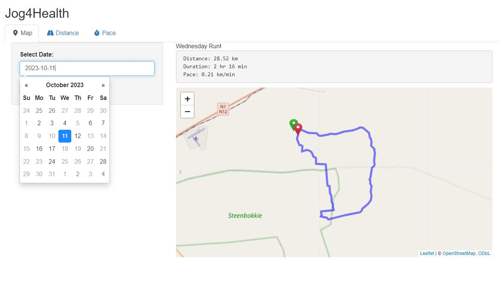
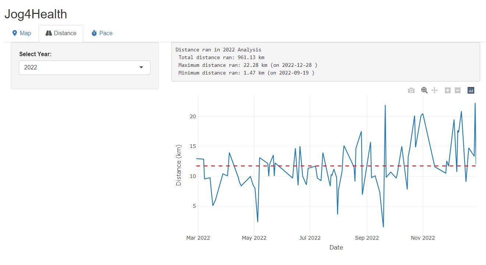
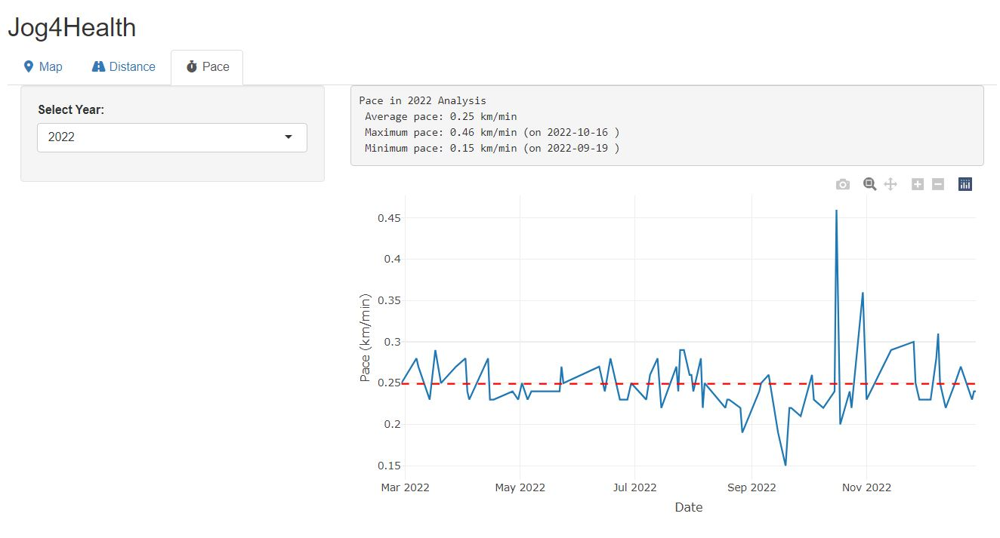

# Jog4Health

Jog4Health is a user-friendly Shiny web application designed to help users analyze jogging activities. 
Whether you’re a casual jogger or a seasoned runner, Jog4Health provides valuable insights into performance, 
allowing users to track progress over time.

## Features

### Map Tab
- **Visualize Routes:** Displays jogging routes on an interactive map. Simply select a date and click "Show Run" 
  to view the route taken on that day. Starting and ending points are marked in green and red, respectively.
- **Calendar Filtering:** Only dates with recorded jogging activities are selectable.

  

### Distance Tab
- **Statistics Overview:** Select a year to view the total distance run, maximum distance, and minimum distance 
  for that year.
- **Distance Plot:** Visualizes distances over time, with a red overlay indicating the yearly average.
- **Zoom Capability:** Users can zoom into specific months to see day-by-day details.

  

### Pace Tab
- **Pace Statistics:** Analyze pace data by selecting a year, which displays average, maximum, and minimum paces.
- **Pace Plot:** Illustrates pacing trends over time, with the yearly average highlighted in red.

  

## Developer
Developed by **Yamkela Kwakwi**, MSc in Data Science, UCT. For inquiries or support, please contact [kwkyam001@myuct.ac.za](mailto:kwkyam001@myuct.ac.za).

## Disclaimer
Jog4Health is provided for informational purposes only. The accuracy of data analysis depends on the quality of input 
data and algorithms used. Results should be interpreted with caution, and users are encouraged to consult fitness or 
healthcare professionals for personalized advice.
